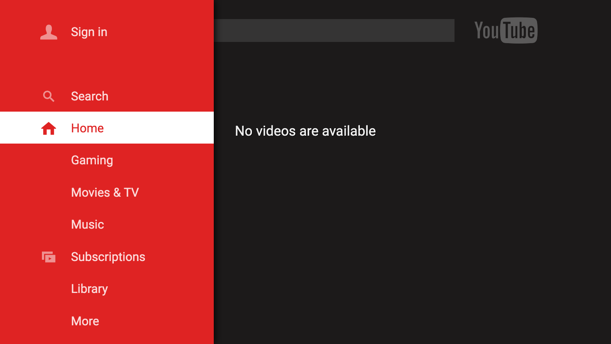
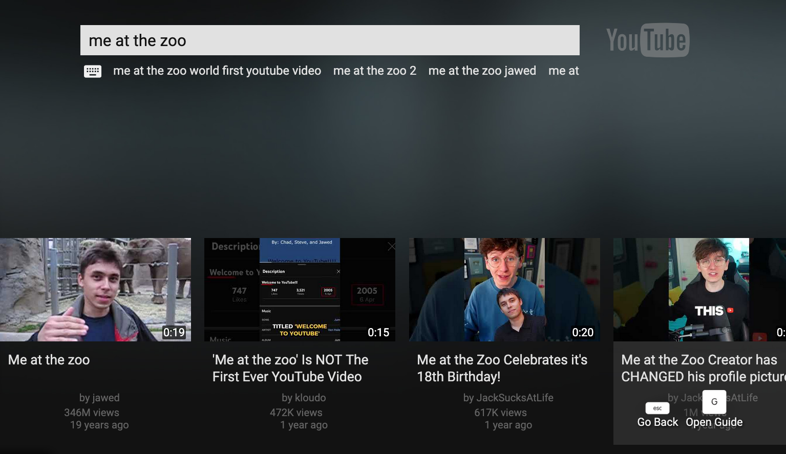
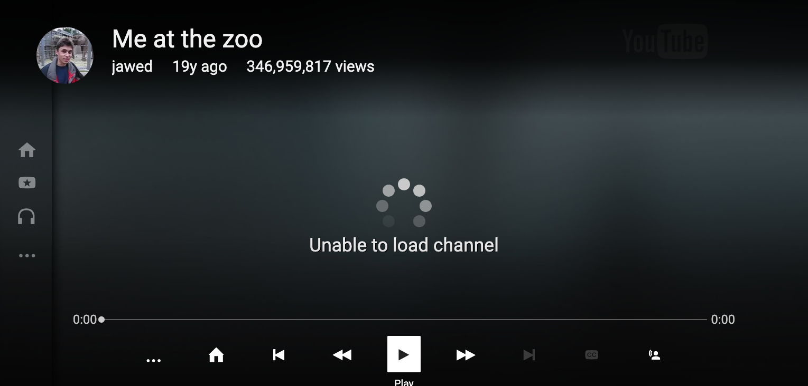

# 2016YouTubeTV

A project to revive the old 2015-2016 YouTubeTV HTML5 Web App.

## Screenshots

**[Note These Are As Of The 25th Of January At 3:30am EST, Things Will Have Changed]**

## Credits

- YouTube/Google

- Erie Valley Software/Erievs

- youtube-dl-exec [https://github.com/microlinkhq/youtube-dl-exec] 

## Why We Use "youtube-dl-exec"

This is so we can get video urls, without having to deal with all the chiper bs you have
to deal with no  ** you will now need python3 installed! though **

## Supported YouTube TV Clients

We only offically supprort 5.20150715 as of right now, however it seems like early 2018
and 2017 ones will work. Someone sort of got a 2018 version running!

Cleints I May Choose To Support In The Future:

Client V4 (https://web.archive.org/web/20140517113435/https://www.youtube.com/tv#/?mode=search)

6.20180807 (https://web.archive.org/web/20180930120208/https://www.youtube.com/tv#/search?resume)

2019 - https://web.archive.org/web/20190301064917/https://www.youtube.com/tv#/search?resume (6.20180807)

(The guide api should work on the above one, since that's what we requested for the json data)

What Will Never Happen:

Clients that fully use GDATA, now there's a chance I may support client V4 as that uses 
innertube for search and stuff, but not fully GDATA ones. Just use YT2009 at that point!

## Setup

**[Note This Really Is Very Early On In The Project, So Guide Won't Be Super Great]**

[Make sure you have nodejs, npm, and python3 (version 3.7.something or above!)]

- Step 1: run git clone https://github.com/erievs/2016YouTubeTV.git

- Step 2: run npm install

- Step 3: run npm start, and you're done!

[When I say V, I mean the version of the YouTube App]

Progress Report
1. Search - 95% Done

    Status: Amost done just need to fix one thing.
    Next Steps: Instead of not dispalying info fully remove a crap video entry with no data.

2. Guide - 100% Done

    Status: Done
    Next None;

3. Browse/Channels - 25% Done

    Status: The Browse API (which is what channels use and the homepage and such)
    Next Steps: Work on getting the v7 formated json to work on v5.

4. Watch - 70% Done

    Status: Got to use a custom /get_video_info, and prase it.
    Next Steps: Format it properly and add the other metadata it needs.

5. Pairing - 0% Done

    Status: Pairing functionality has not been started.
    Next Steps: Fixing pairing features with the TV app.

6. Sign In - 0% Done

    Status: Sign in functionality has not been started.
    Next Steps: Fixing sign in features with the TV app.

7. Assets - 90% Done

    Status: Most of the assets are there, with a few missing sound files and 404 errors that need to be addressed.
    Next Steps: Find the missing assets and add em.

8. Other

- Get it to load the background on homescreen.

- Make live.js work better (it sometimes causes issues with the guide, however it isn't the guides fault.)

- Support other versions of YouTube TV

- Other languages

- Fix grammar
